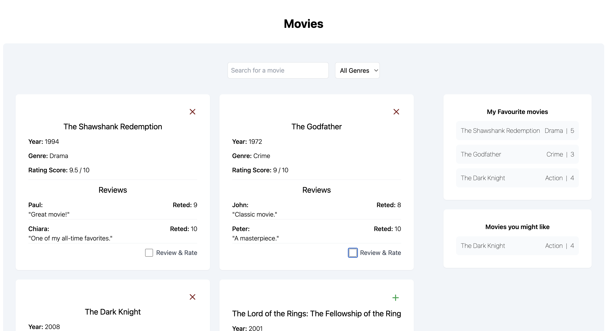
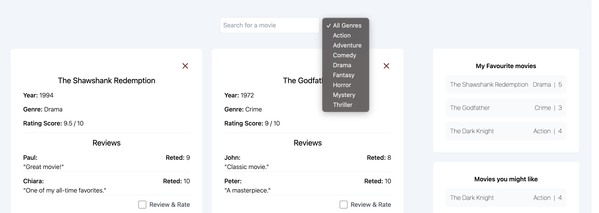

# Movie Rating App

This is a simple movie rating application built with Vue.js and Tailwind CSS.

## Features

- Explore Movies: Browse through a list of movies and filter them by genre or search term.
- Rate Movies: Give movies a rating on a 1-5 star scale.
- Review Movies: Write reviews for movies and see them displayed alongside the average rating.
- Custom Movie Lists: Create and save custom movie lists, such as "My Favourite Movies"
- Local Storage: All your ratings, reviews, and custom lists are saved to local storage, so you can see them when you return to the site.
- And suggestion algorythem based on genres in movies stored in "My Favourite Movies"






## Project setup

First, clone the repository:

```bash
git clone https://github.com/Yariandres/vue-mastery-movies
```

Then, navigate into the project directory and install the dependencies:

```bash
cd movie-rating-app
npm install
```

To start the development server, run:

```bash
npm run dev
```
